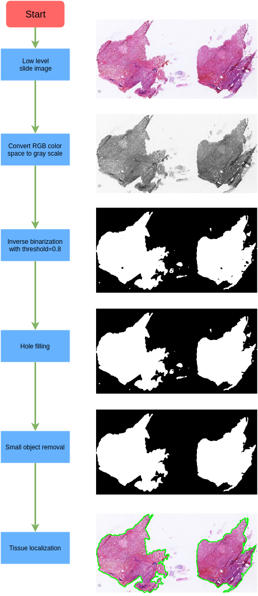

# Background
Automatic whole slide image (WSI) diagnosis is gradually becoming a research hotspot in biomedical imaging domain [@barker2016automated][@cruz2014automatic]. Because of the gigabyte size of WSI, patch-based strategy is the de facto method to deal with WSI, instead of directly taking the WSI as input [@chen2018automatic]. Considering the large white background region as well as the computational cost, tissue localization need to be conducted before WSI diagnosis. After tissue localization, we can then just focus on those patches inside the tissue regions.

# Overview
``tissueloc`` is a python-based package written for whole slide pathology image tissue localization, which mainly contains two functionalities. First, selecting the proper level for the following tissue localization. The width and height of WSI is far larger than 10,000 pixels. However, based on WSI having pyramid storage structure, we can select a low level image of the slide. The low level slide image can have much smaller size. This selection is based on the setting of maximum width or height the low level image could be. We then select the low level image with size just smaller than the predefined setting. Second, tissue localization utilizes a series of basic image processing techniques. This localization is based on the selected low level image, thus reducing the computational cost. The main procedures include: 1) Low level slide image loading. 2) Color space conversion from RGB to gray. 3) Inverse binarization to a binary image. 4) Hole filling of the binarized image. 5) Small object removal. 6) Contour finding.

This whole slide tissue localization is entirely based on basic image processing techniques, and could act as a preprocessing step for whole slide image automatic analysis. 

# Acknowledgement
Development was supported by National Institutes of Health R01 AR065479-02.

# References
